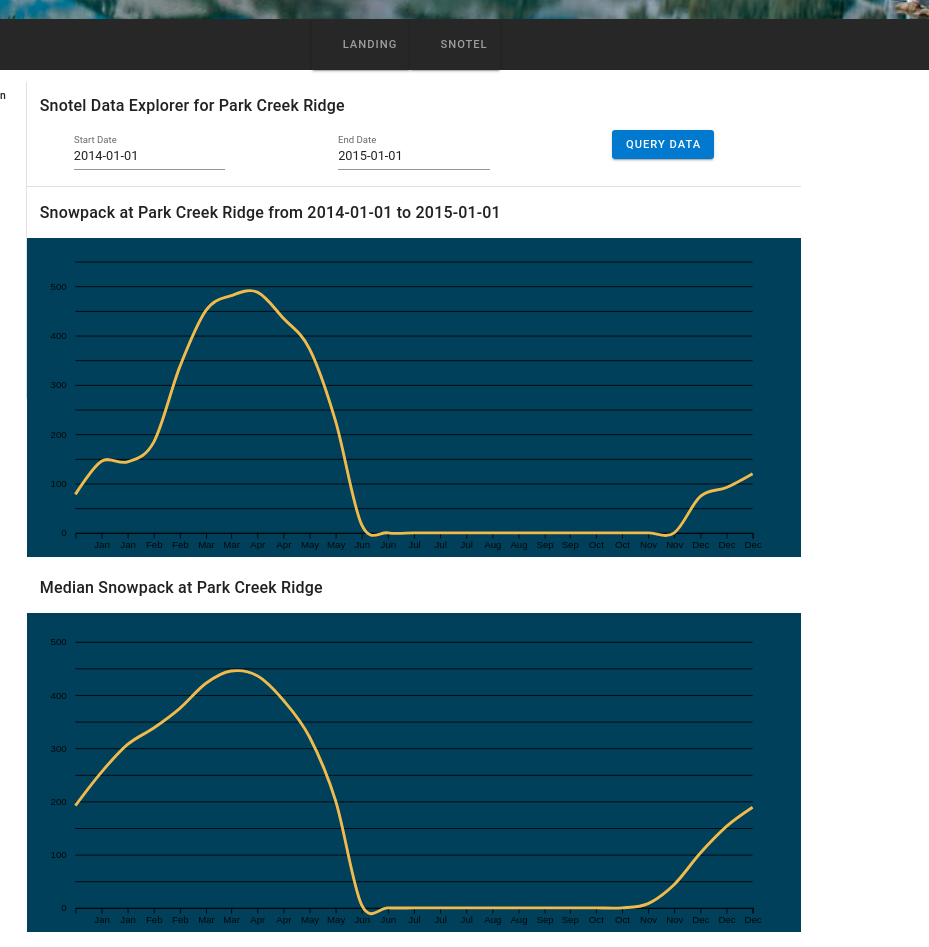

# Snotel Pipeline README #
This repository includes a dockerized data pipeline which scrapes snowpack & streamflow data from the USDA and pushes to a DynamoDB table.
I provide implementaitons of equivalent APIs using spring boot, flask & a serverless API using AWS SAM

The range of dates which the scraper runs can be changed in the scrape_snowpack_data() function, at the bottom of the 
snotel.py file.  

### Snotel Pipeline, Query API, FrontEnd & Data Analysis ###
* Data Pipeline
    - Containerized data pipeline which scrapes USDA website with the BeatifulSoup python library
    - Push data items to DynamoDB
* Serverless Query API
    - Implementation of a serverless API using AWS SAM (serverless application model)
* Spring Boot Query API
    - Implementation of a query API in Spring Boot
* Front End Website for querying the data & data visualization 
    - Vue JS
    - D3 JS 

* List of eight locations (there are 120 monitored by the USDA but felt as though eight was plenty for demonstrative purposes)

    
* Snowpack data for the year 2014 at Park Creek Ridge & median snowpack 
    
    

 
* Simple Apache Spark analysis
    - Perform exploratory data analysis with Spark by constructing dataframes & running a few simple Spark SQL queries 

### Reproduction steps ###

* Run pipeline
    - docker-compose -f snotel-dynamo-compose.yaml up --build
* Deploy the serverless API
    - cd apis/snotel-serverless-api
    - bash deploy.sh
* Deploy the spring boot query API
    - cd apis/snotel-spring-api
    - mvn clean package
    - java -jar target/snotel-spring-api-0.0.1-SNAPSHOT.jar --server.port=8090 
    - query the data from browser or postman (assuming the pipeline has been run)
        - http://localhost:8090/snotel?location=Trinity&sdate=20140101&edate=20140201

* Run the front end
    - cd snotel-vue
    - npm run serve
    - Navigate to the Snotel Data tab on the left navigation bar and select a location
    - Select a range of dates & click on the Query Data button
    - A plot of the data should appear (if the API endpoint is set up correctly) 

* Run the analysis
    

### In Development ###
* Currently item is being pushed to DynamoDB individually when I should be performing batch operations
* Create a React front end
* Deploy the Spring Boot API to ECS (I've already done that just need to find time to add this to the repo)